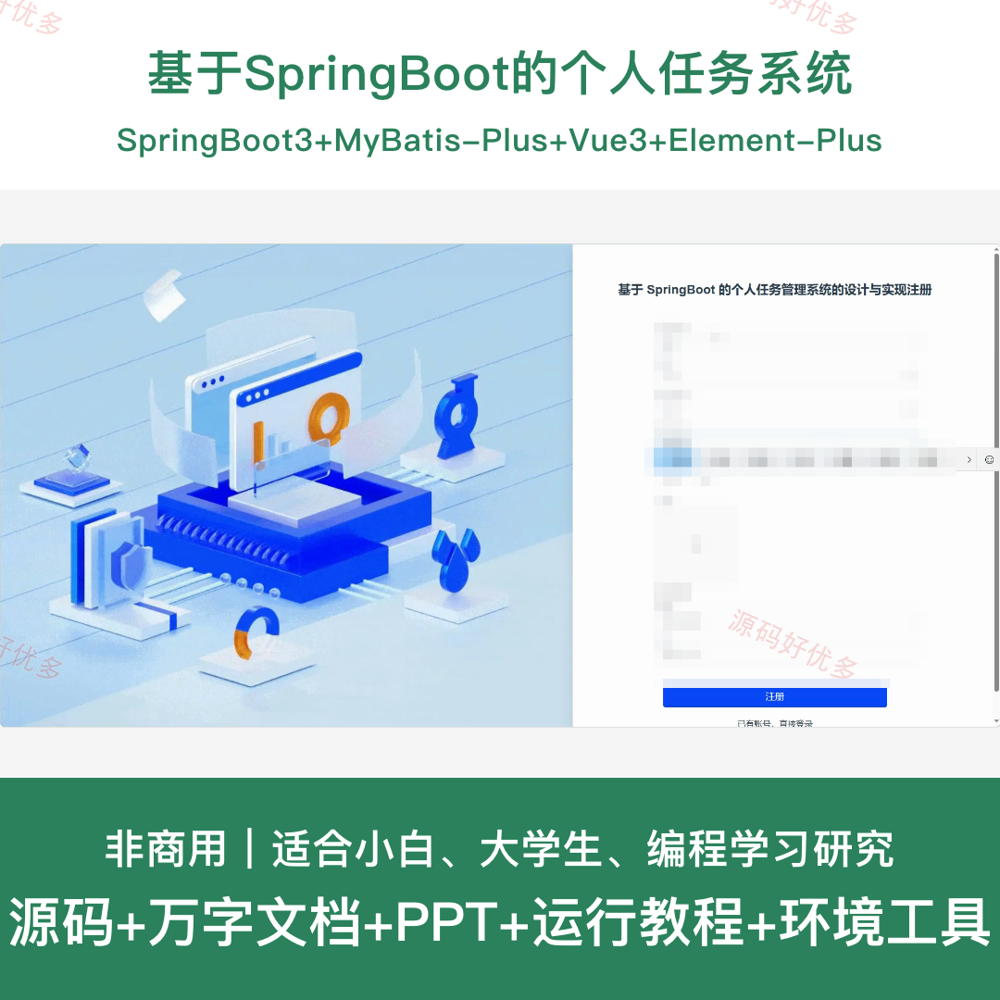
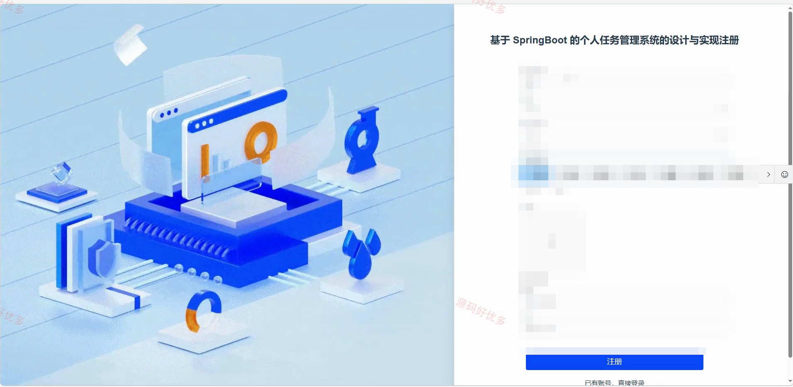
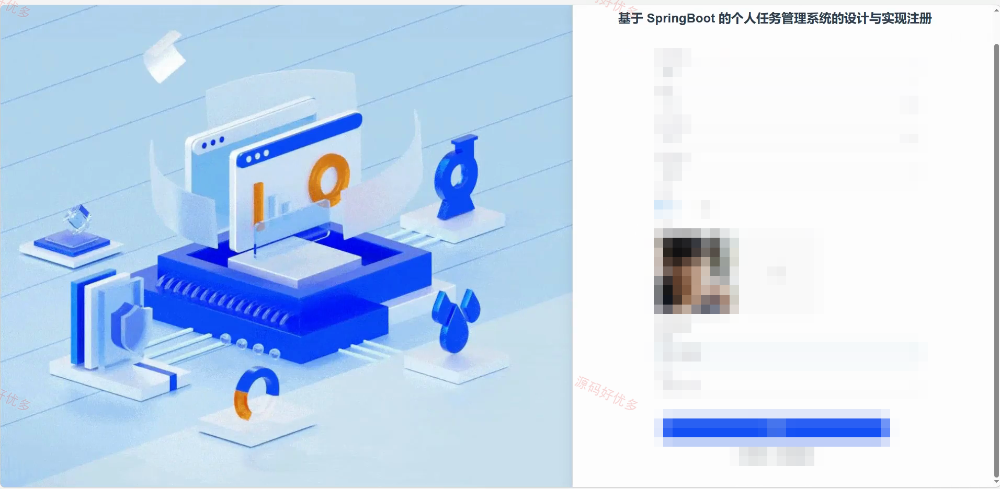
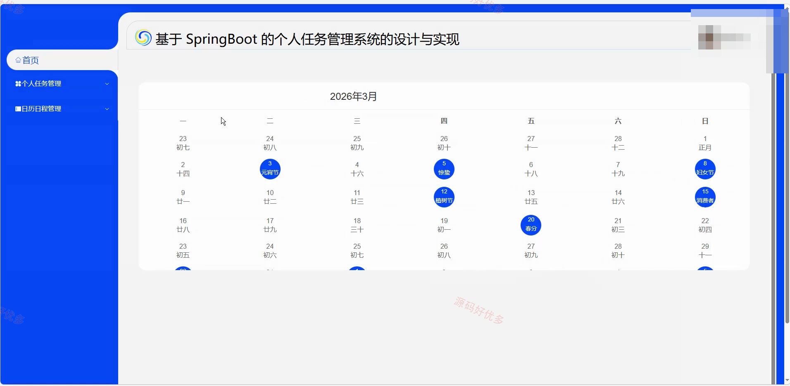
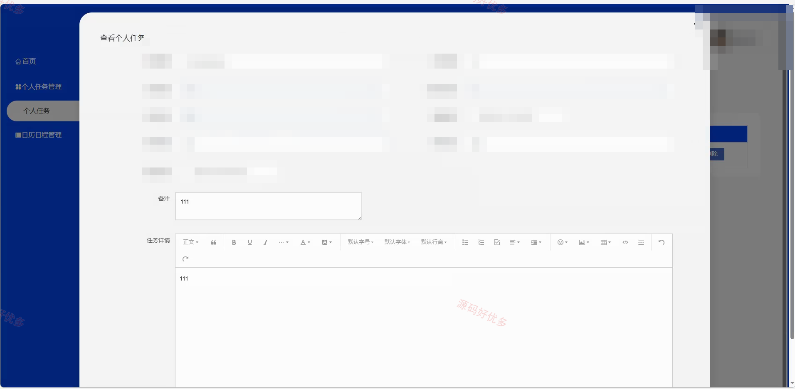
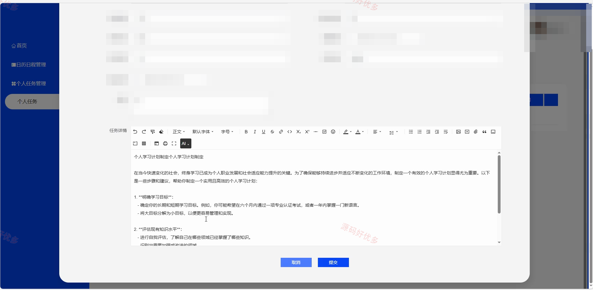
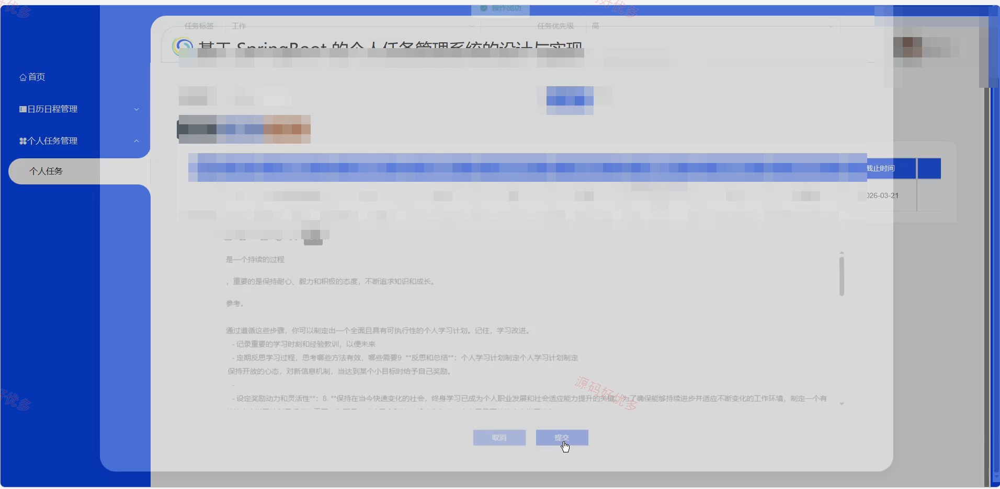
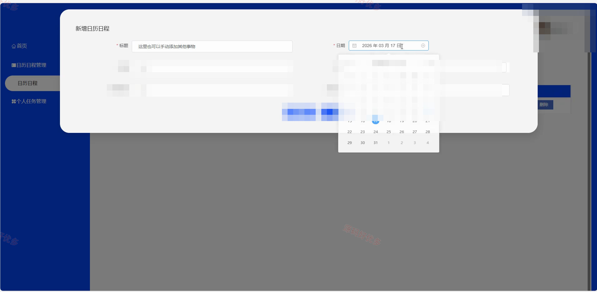
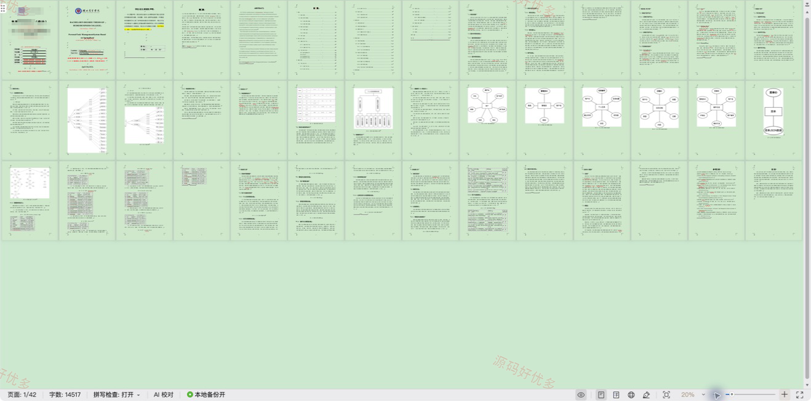

## 源码问题查看主页咨询

### 一、关键词
个人任务管理系统、个人任务、个人任务信息管理、个人任务后台管理

### 二、作品包含
源码+数据库+万字设计文档+PPT+全套环境和工具资源+本地部署教程

### 三、项目技术
前端技术： Html、Css、Js、Vue3.5、Element-Plus
后端技术：Java、SpringBoot3.3.0、MyBatis-Plus

### 四、运行环境（以下版本亲测，其他版本兼容性请自行测试）
开发工具：IDEA/eclipse + VSCODE

数据库：MySQL8.0+（共8张表）

数据库管理工具：Navicat10以上版本

环境配置软件： JDK17 + Maven3.6.3

前端Nodejs：16+

浏览器：谷歌浏览器

### 五、项目介绍
项目编号：springbootA705D

基于SpringBoot的个人任务管理系统面向用户、管理员，提供个人任务管理、日历日程管理、操作日志管理、管理员管理等功能，实现各角色在系统中的实际业务协作。

角色：用户、管理员

用户功能：后台登录、后台注册、个人任务管理、日历日程管理。

管理员功能：后台登录、操作日志管理、菜单管理、日历日程管理、用户管理、管理员管理、个人任务管理。

### 六、运行截图

